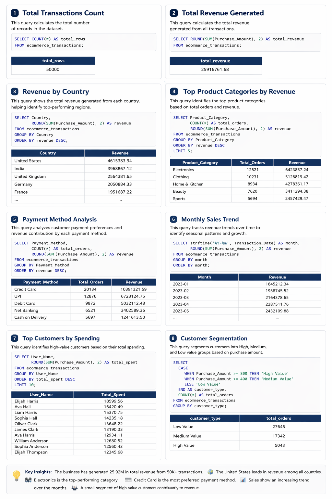

# 📊 E-Commerce SQL Data Analysis

🚀 SQL project analyzing 50K+ e-commerce transactions to extract business insights.

---

## 📌 Overview
This project performs data analysis on a large e-commerce dataset using SQL.  
The goal is to uncover insights related to revenue, customer behavior, product performance, and sales trends.

This project demonstrates end-to-end data analysis using SQL on a structured transactional dataset.

---

## 🛠 Tools Used
- SQL (SQLite)
- DB Browser for SQLite

---

## 📂 Project Structure

- `analysis.sql` → Contains all SQL queries used for analysis  
- `ecommerce_sql_analysis_report.png` → Visual summary of insights  
- `README.md` → Project documentation  

---

## 🔍 Key Analysis Performed

### 💰 Total Revenue
Calculated total revenue generated from all transactions.

### 🌍 Revenue by Country
Identified top-performing countries based on total sales.

### 🛍️ Product Category Analysis
Analyzed top product categories by revenue and order volume.

### 💳 Payment Method Analysis
Examined customer payment preferences and their impact on revenue.

### 📅 Monthly Sales Trend
Tracked sales trends over time to identify patterns and seasonality.

### 👑 Top Customers
Identified high-value customers based on total spending.

### 🎯 Customer Segmentation
Segmented customers into High, Medium, and Low value groups based on purchase amount.

---

## 🧠 Key Insights

- High-value customers contribute significantly to overall revenue  
- Certain countries dominate total sales  
- Product demand varies across categories  
- Payment methods influence transaction behavior  
- Sales show noticeable trends over time  

---

## 📁 Dataset

This project uses a synthetic e-commerce dataset containing **50,000 transaction records**.

### 📌 Overview
The dataset includes detailed information about user demographics, purchase behavior, and transaction details. It is designed for data analysis, visualization, and machine learning experiments.

### 📊 Columns
- **Transaction_ID** – Unique identifier for each transaction  
- **User_Name** – Randomly generated user name  
- **Age** – Age of the user (18 to 70)  
- **Country** – Country where the transaction occurred  
- **Product_Category** – Category of purchased item  
- **Purchase_Amount** – Amount spent per transaction  
- **Payment_Method** – Payment method used  
- **Transaction_Date** – Date of purchase  

### 🎯 Use Cases
- Sales and trend analysis  
- Customer segmentation  
- Payment behavior analysis  
- Revenue insights and forecasting  

### ⚠️ Note
This dataset is **synthetic** and created for educational and analytical purposes. It does not contain real user data.

### 🔗 Source
https://www.kaggle.com/datasets/smayanj/e-commerce-transactions-dataset

---

## 🚀 Conclusion
This project demonstrates how SQL can be used to analyze large datasets and extract meaningful business insights for decision-making.

---

## 📸 Analysis Report

---

## 💼 Author
**Aniket Khakre**  
Aspiring Data Analyst
